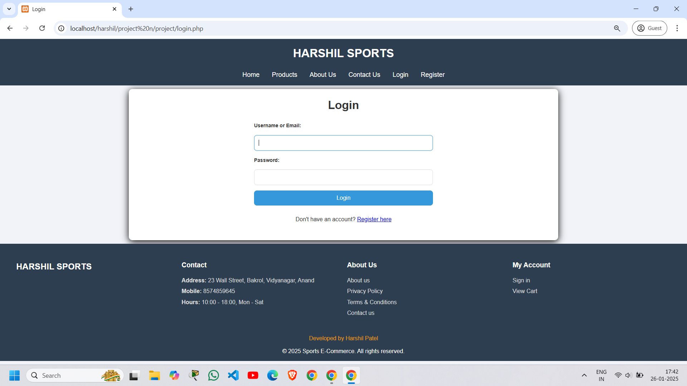

# Sports Website

Welcome to the Sports Website, a dynamic e-commerce platform built using PHP. The website allows users to browse and purchase sports products, register an account, and maintain a shopping cart, with a focus on seamless user experience and session management.

## Authors

- [@HarshilPatel](https://www.github.com/Harshil-Patel23)


## Technologies Used

Frontend: HTML,CSS, JavaScript

Backend: PHP

Database: MySQL (managed via phpMyAdmin)


## Features

- **User Authentication:** Login and register functionality with secure session management.
- **Products:** Browse and view sports products from a database.
- **Shopping Cart:** Add, remove, and update items in the cart.
- **Checkout:** Secure checkout process integrated with a payment gateway.
- **Order Management:** View order history and track placed orders.
- **Informational Pages:**
    - Contact Us
    - About Us
    - Terms and Conditions
- **Responsive Design:** User-friendly interface across devices.

## Usage

- **Register:** Create an account to access the website features.
- **Login**: Sign in with your credentials.
- **Browse Products:** Explore the sports products listed on the website.
- **Cart Management:** Add items to your cart, modify quantities, or remove products.
- **Checkout:** Complete the purchase process and view confirmation.
## Project Structure

|---- images

|----style.css

|----index.php

|----login.php

|----checkout.php

|----cart.php

|----register.php

|----tandc.php

|----about.php

|----contact.php

|----confirmation.php

|----db_config.php

|----header.php

|----footer.php

|----privacy.php

|----logout.php

## Database Schema

The database consists of the following tables:

- **Users:** Contains user details such as User ID, username, email, password and address.
- **Orders:** Stores order details like order ID, user ID, order date, and total price.
- **Products:** Manages product details, including product ID, name, category, description, price, and image URL.
- **Payments:** Tracks payment information, including payment ID, order ID, paymnet method, payment status, transaction ID, amount, payment date, card last 4 digit, and card expiry.
- **order-items:** Store orderd items info such as order ID, order item ID, product ID, quantity, price
- **contact requests:** store information like name, email, message and request ID

## Screenshots

### Homepage


### Login Page



### Products Listing


### Cart Page


### Checkout Page


### Confirmation Page


## Installation

### Prerequisites

- XAMPP or any LAMP/WAMP stack installed on your system.
- PHP 7.4 or higher.
- MySQL database.

### Steps

1. Clone the repository:

```
git clone https://github.com/Harshil-Patel23/Sports-Website-Using-PHP.git  

```
2. Move the project to your web server's root directory (htdocs for XAMPP).
3. Start the Apache and MySQL services using your local server stack.
4. Import the database: 
    - Open phpMyAdmin.
    - Create a new database named sports_website.
    - Import the sports_website.sql file from the repository.

5. Configure the database connection:
    - Update the config.php file with your database credentials:
    ```
    <?php  
    $host = 'localhost';  
    $user = 'username';  
    $password = 'your password';  
    $database = 'your databse name';  
    $conn = new mysqli($host, $user, $password, $database);  
    if ($conn->connect_error) {  
    die('Connection failed: ' . $conn->connect_error);  
    }  
    ?>  
    ```
6. Open the project in your browser

    ```
    http://localhost/sports-website  

    ```
## Future Enhancements

- Add user profile management.
- Integrate a live chat support system.
- Implement product reviews and ratings.
- Enhance security with OAuth login (Google/Facebook).